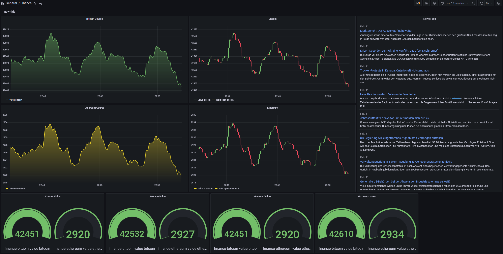
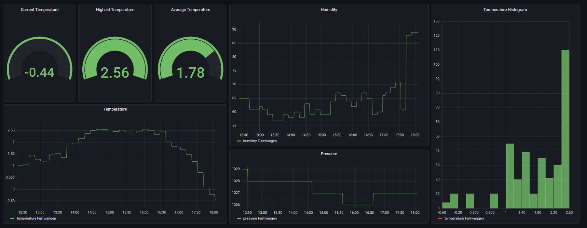
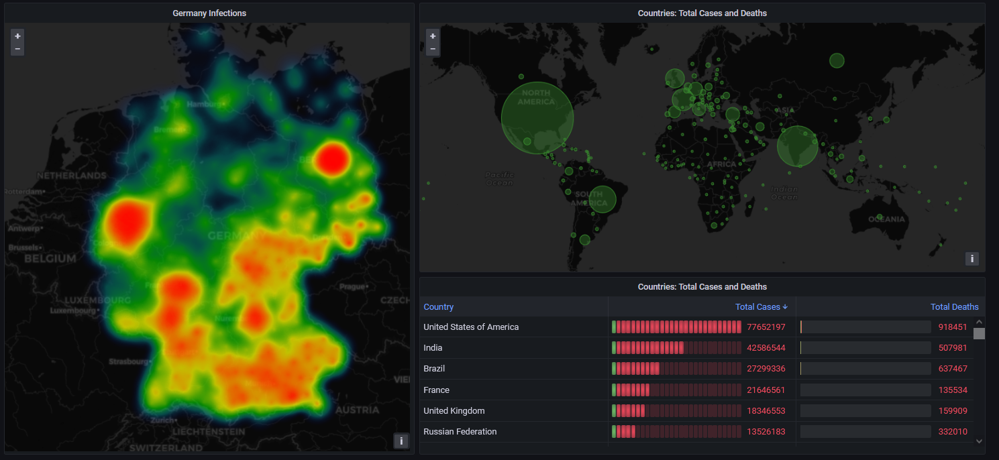
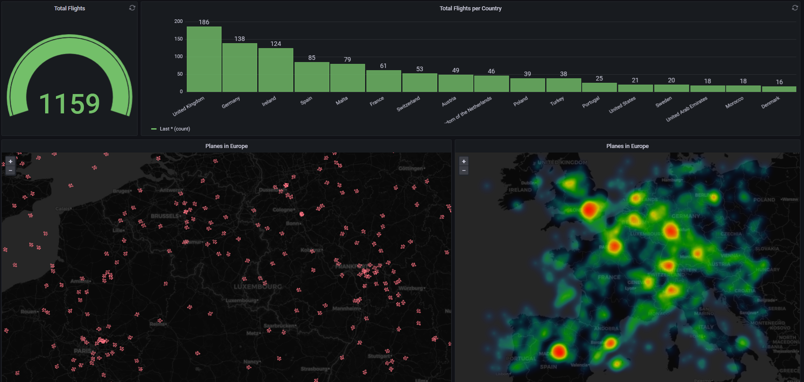

# Seminararbeit zum Thema Visualisierung von Datenströmen 

Diese Arbeit entstand als Seminararbeit im Rahmen der Veranstaltung Event Processing an der Hochschule Furtwangen. 

## Kursverlauf der Kryptowährungen Bitcoin und Ethereum

## Wetterdaten für die Stadt Furtwangen im Schwarzwald

## Visualisierung der Infektionszahlen für Deutschland und die Welt

## Flugradar für den europäischen Luftraum

